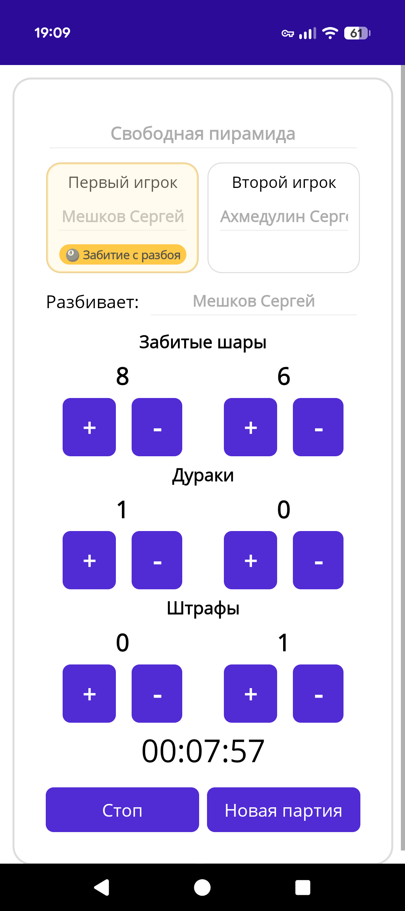
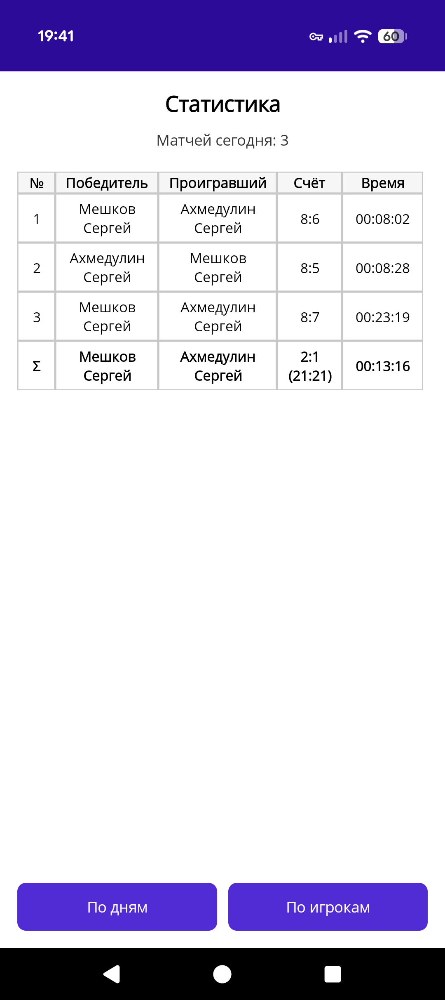
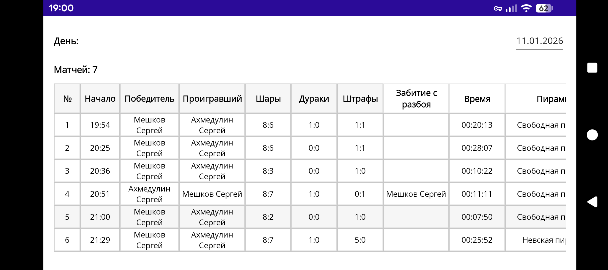
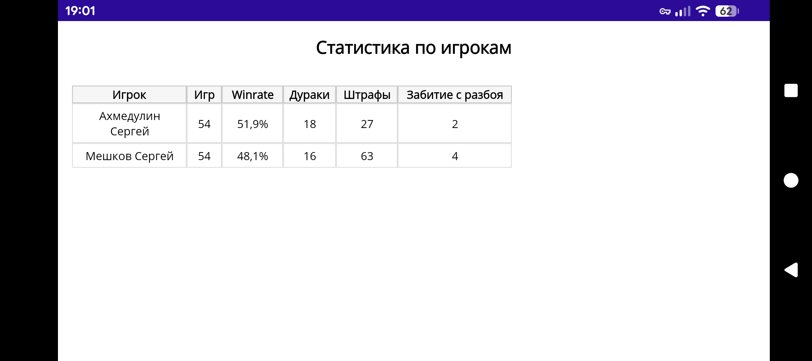

# 🎱 Billiards — Match Timer & Stats (MAUI)

Приложение для ведения счёта в бильярде и сохранения статистики матчей.  
Сделано на **.NET MAUI** (основной таргет — **Android**, личное использование).

  

## 📝 Содержание

- [Что умеет](#functions)
- [Детали приложения](#detail)
- [Платформа и используемые библиотеки](#library)
- [Запуск и сборка](#build)

## ✨ Что умеет 

<table align="center">
  <tr>
    <td width="300" valign="top">
      
    </td>
    <td valign="top">

### Главная страница
- Выбор вида игры (пирамиды)
- Выбор игроков из списка
- Счётчики: **забитые шары**, **дураки**, **штрафы**
- Таймер партии: старт / пауза / продолжить / сброс
- Отметка **«забил с разбоя»** (долгое нажатие на имя игрока)
- Выбор “кто разбивает”

    </td>
  </tr>

  <tr>
    <td width="300" valign="top">
      
    </td>
    <td valign="top">

### Страница статистики
- Статистика за текущий день
- Группировка по парам игроков
- Summary-строка `Σ` по каждой паре
- Подробная статистика **по дням**
- Статистика **по игрокам** (агрегаты)

    </td>
  </tr>

  <tr>
    <td width="300" valign="top">
      
    </td>
    <td valign="top">

### Настройки
- Светлая / тёмная тема
- Звуки (голос/эффекты)
- Режим штрафов (взаимоисключающие переключатели)
- Разрешение ухода в минус по шарам
- Учитывать дураков в итоговом расчёте
- Добавление/удаление игроков
- Экспорт/импорт JSON (бэкап)
- Очистка БД

    </td>
  </tr>
</table>

### 📊 Детальные экраны статистики

  
  

---

## 💾 Данные и хранение 

### БД: SQLite
Сохраняется:
- игроки
- матчи (статистика матчей)

### Бэкап/восстановление
- экспортирует **все данные** в один JSON-файл
- импорт делает **полное восстановление** (с заменой текущих данных)

## 🔊 Звуки

Если включены звуки:
- некоторые действия (например добавление игрока / инкремент “дураков”) проигрывают подготовленные аудио-фразы.

Файлы звуков лежат в `Resources/Raw/`.

## 📱 Проблемы с отображением UI элементов
Поскольку приложение разрабатывалось для личного пользования, UI был подогнан под смартфон Pixel 10 с разрешением экрана 2424×1080 пикселей.
На других устройствах возможны проблемы с отображением UI.

---

## 🔧 Технологии 

- **.NET 9**
- **.NET MAUI**
- **EF Core + SQLite** (локальная база на устройстве)
- **CommunityToolkit.Maui** (жесты / удобные UI-хелперы)
- **Plugin.Maui.Audio** (проигрывание звуков)

---

## 🚀 Запуск и сборка 

### Требования
- Visual Studio 2022+ с workload **.NET MAUI**
- Android SDK / эмулятор или устройство
- .NET SDK 9.x

### Для Android-публикации нужен **подписанный** APK.
1. Нажмите правой кнопкой мыши на проект и выбирите **'Publish'**
2. Дождитесь окончания архивирования и нажмите на кнопку **'Distribute'**
3. В появившемся окне нажмите кнопку **'Ad Hoc'** и подпишите APK файл. При отсутсвии ключа его можно создать в этом же окне.
4. Сохраните APK файл в любое удобное место
5. Enjoy!
